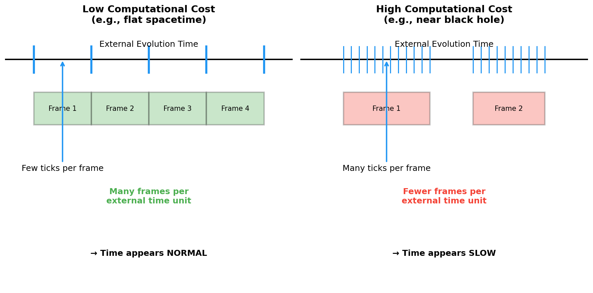

# Model in Brief: Why Time Dilates Here

**Plain-English mechanism:**  
Time is the count of **Planck-scale resolution ticks** an observer experiences. When a region is harder to resolve (because of high velocity or strong gravity), the **computational cost** to render one "frame" of that region increases. More Planck ticks are needed per frame. With a finite global evolution, that region emits **fewer frames per external unit** → it **appears slower** to outside observers (time dilation). Locally, the observer's tick cadence feels unchanged.

**Key elements (repo language):**
- \(N\): a measure of **computational capacity** available to resolve a region.
- \(B(N)\): a **constitutive law** that maps capacity to spatial/temporal resolution properties used by the metric and geodesics.
- Metric structure (high level): temporal and spatial intervals are modulated by capacity-dependent factors derived from \(N\) and \(B(N)\).

**Intuition diagram:**  

- **Low computational cost:** Few ticks per frame → many frames per external unit → time appears "normal."
- **High computational cost:** Many ticks per frame → fewer frames per external unit → time appears "slow."

**Relationship to known effects:**  
- **Special relativity (velocity):** Higher relative velocity increases the computational load to resolve evolving states, raising ticks per frame → external observers see slower time.
- **General relativity (gravity):** Deeper gravitational potential similarly increases resolution cost and ticks per frame → gravitational time dilation.

**Falsifiability & handles:**  
- If we can **operationalize \(N\)** (e.g., as gate rate per Planck 4-volume, information density, or bandwidth to a resolution mesh), we can fit or refute \(B(N)\) using canonical tests (PPN, light bending, Shapiro delay, Mercury) and cosmological data.

See the quick visual in [notebooks/01_Time_Dilation_Ticks.ipynb](../notebooks/01_Time_Dilation_Ticks.ipynb).
